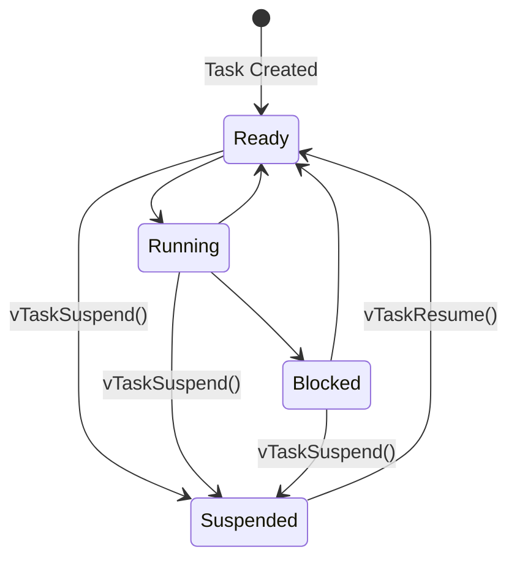
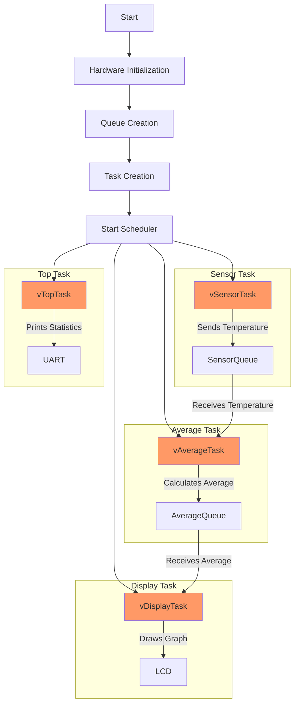

# FreeRTOS Project
Sistemas Operativos II - TP4 - 2024

---

## Objetivo
El objetivo del presente trabajo practico es que el estudiante sea capaz de diseñar, crear, comprobar y validar una aplicacion de tiempo real sobre un RTOS.

Se pide que, utilizando **QEMU**, emulando un sistema **Stellaris LM3S811**, se desarrolle una aplicacion basada en **FreeRTOS** que contenga las siguientes caracteristicas.

1. Una tarea que simule un sensor de temperatura. Generando valores aleatorios, con una frecuencia de 10 Hz.
2. Una tarea que reciba los valores del sensor y aplique un filtro pasa bajos. Donde cada valor resultante es el promedio de las ultimas N mediciones.
3. Una tarea que grafica en el display los valores de temperatura en el tiempo.
4. Se debe poder recibir comandos por la interfaz UART para cambiar el N del filtro.
5. Calcular el stack necesario para cada task. Realizar el analisis utilizando
`uxTaskGetStackHighWaterMark` o `vApplicationStackOverflowHook`.
6. Implementar una tarea tipo top de linux, que muestre periodicamente estadisticas de las tareas (uso de cpu, uso de memoria, etc)

---

## Implementacion
Este trabajo esta basado sobre la DEMO proporcionada desde la instalacion de [FreeRTOS](https://www.freertos.org/a00104.html), la cual nos da una base para poder comenzar a trabajar, con sus librerias y configuraciones necesarias.

Para poder correr el proyecto se necesita tener instalado [QEMU](https://www.qemu.org/download/) para emular nuestra placa y [gcc-arm-none-eabi](https://developer.arm.com/downloads/-/gnu-rm) para compilar el proyecto. Una vez instalados estos paquetes, se puede correr el proyecto utilizando el `build.sh` o con los siguientes comandos, dentro de nuestro directorio `DEMO`.

```bash
make clean
make
qemu-system-arm -machine lm3s811evb -kernel gcc/RTOSDemo.axf -serial stdio
```

Estas flags de QEMU nos permiten emular la placa en particular que estamos utilizando, cargar nuestro binario y utilizar la consola serial para interactuar con nuestra aplicación.

## Tasks
Para la implementación de las tareas, se crearon 4 tareas en total, una para cada requerimiento del enunciado Sensor, Filtro, Graficador y Top. La comunicación entre las tareas se realiza mediante colas de mensajes, donde cada tarea envia y recibe mensajes de otras tareas utilizando las funciones `xQueueSend()` y `xQueueReceive()`.

La politica de planificacion por default de FreeRTOS es **preemptive** es decir que el planificador siempre ejecutara la tarea de mayor prioridad que este disponible, con **prioridades fijas**, utilizando **round-robin** para tareas de igual prioridad, cambiando entre ellas en cada interrupcion de reloj. Esta configuracion es modificable en el archivo `FreeRTOSConfig.h` desde la constante `configUSE_PREEMPTION`, y el **time-slicing** se puede activar desde la constante `configUSE_TIME_SLICING`.

En FreeRTOS las tareas tienen los siguientes posibles estados:
- **Running**: La tarea esta siendo ejecutada.
- **Ready**: La tarea esta lista para ser ejecutada.
- **Blocked**: La tarea esta esperando por un evento.
- **Suspended**: La tarea esta suspendida.
- **Deleted**: La tarea fue eliminada.



En el siguiente diagrama de flujo se puede ver la secuencia de inicializacion de las tareas y el flujo de datos entre ellas, donde se puede ver las 4 tareas creadas y como se comunican entre ellas a traves de las colas de mensajes, estas tareas son ejecutadas gracias al planificador de tareas de FreeRTOS.



### vSensorTask
Para la tarea del sensor, se utilizo un generador de números aleatorios, que simula la lectura de un sensor de temperatura, con una periodicidad data por la constante `mainSENSOR_DELAY` seteada a 10 [Hz]. El delay necesario para ejecutar periodicamente la tarea se logra con la funcion `vTaskDelayUntil()`, en la cual se indica el tiempo para volver a ejecutar desde la ultima vez que se llamo a la funcion.

Dentro del loop de ejecucion se genera este numero aleatorio con la funcion `uiGetRandomNumber()`, se ajusta este nuevo valor sumandole `1` o `-1` a la temperatura anterior y se verifica que no exceda los limites dados por `MAX_TEMP` y `MIN_TEMP`. Esta nueva temperatura es enviada a la cola de mensajes `xSensorQueue` para ser procesada por la tarea del filtro.

### vAverageTask


### vDisplayTask


### vTopTask
La tarea `vTopTask` es la encargada de mostrar las estadisticas de las tareas en ejecucion al estilo de comandos como `top` o `htop` en linux, para esto se utiliza la funcion `vTaskGetRunTimeStats()`, la cual nos devuelve un string con las estadisticas de las tareas, como el tiempo de ejecucion, el uso de la cpu, el uso de la memoria, etc. Esta tarea se ejecuta cada un delay dado por `mainTOP_DELAY` y utiliza `UART0` para enviar las estadisticas y mostrarlas en la consola.

Para el envio de datos por UART se utilizo la funcion `UARTCharPut()` que envia un caracter por UART, y se envia el string de estadisticas caracter por caracter hasta llegar al final del string. Al tener numeros enteros en las estadisticas se debe convertir las mismas a string, para ello hacemos uso de `cUnsignedIntToString()`.

```
TASK    CPU%    STACKFREE   TICKS
-----------------------------------
Top     <1%     84          126
IDLE	97%     134         397011
Sensor	<1%     102         37
Display	2%      10          8584
Average	<1%     88          83
```

Viendo esta salida podemos ver que el estado idle es el que mas tiempo de cpu consume, ya que es el que se ejecuta cuando no hay ninguna otra tarea disponible, y que la tarea de display es la que mas tiempo de cpu consume. Esto tiene sentido ya que las tasks son muy simples y de bajo overhead, por eso el procesador se pasa mas tiempo en idle que ejecutando tareas, siendo la parte de display con el envio de uart incluido es lo que mas consume. Las tareas de Sensor y Average son solo calculos matematicos y no consumen mucho tiempo de cpu.

---

## Ejemplo de ejecucion

<p align="center">
  <br>
  <em>Fig 1. Gif del programa en ejecucion.</em>
</p>

---

## Bibliografia
- [FreeRTOS API Reference](https://freertos.org/a00106.html)
